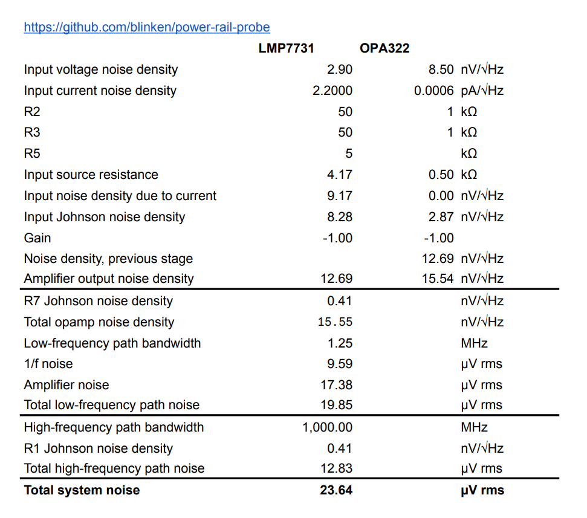

# Power rail probe

An Open Hardware low-noise power rail oscilloscope probe, based on the excellent writeup by
[Andrew Levido](https://circuitcellar.com/research-design-hub/projects/building-a-power-rail-probe/)
[PDF archive](doc/circuit_cellar-building_a_power_rail_probe.pdf)

The probe accepts a connection from a power rail under test, via a 50-ohm
cable. AC is passed, and an adjustable offset is applied to the DC voltage,
allowing power supply ripple and transients to be viewed.

 * Max voltage offset ±20V
 * DC input impedance 50kΩ
 * Attenuation of 1:1.2 or better
 * Active signal range ±1V
 * Noise level < X uVrms (X dBm)
 * Isolation between chassis/USB and BNC test connectors.
 * Battery powered to minimise noise. Runtime approx X hours.
 * Li-Ion 18650 batteries rechargeable via USB-C connector (9V+ USB-PD supply required).

It should be connected to an oscilloscope set to 50-ohm input impedance.

**This project is not yet complete. Outstanding work -**
 * PCB layout
 * Testing and characterisation

## Schematic

[View on KiCanvas!](https://kicanvas.org/?github=https%3A%2F%2Fgithub.com%2Fblinken%2Fpower-rail-probe)

## Noise analysis

The design aims to minimise the noise introduced by the instrument. Low-noise
operation is achieved through careful layout to minimise noise-generating
elements in the critical path, plus battery operation.  Batteries are recharged
when the instrument is turned off.

The theoretical noise introduced by the probe is 23.64 µVrms over the 1GHz
design bandwidth. Actual noise levels will be slightly higher in the finished
product.

[PDF](doc/noise-analysis.pdf) [ODS](noise-analysis.ods) [XLSX](noise-analysis.xlsx)

## Bill of materials

 * [LMP7731](https://www.ti.com/lit/ds/symlink/lmp7731.pdf) Ultra-low noise precision RRIO opamp
 * [OPA322](https://www.ti.com/lit/ds/symlink/opa322.pdf) 20-MHz low-noise 1.8-V RRIO opamp
 * ADP7142AUJZ-2.5 +2.5V 200 mA low noise LDO Linear Regulator
 * ADP7182AUJZ-2.5 -2.5V 200 mA low noise LDO Linear Regulator
 * MCP73213T-A6SI/MF Dual-cell, Li-Ion/Li-Polymer charge management controller, 8.4V float
 * STUSB4500QTR Standalone USB PD sink controller
 * Molex 105450-0101 USB-C receptacle
 * An aluminium extrusion case suitable for a 70x114mm board - eg, [AliExpress](https://www.aliexpress.com/item/1005003326971939.html)

## Front/rear panel layout

## License

[CC BY-SA 3.0](https://creativecommons.org/licenses/by-sa/3.0/)
