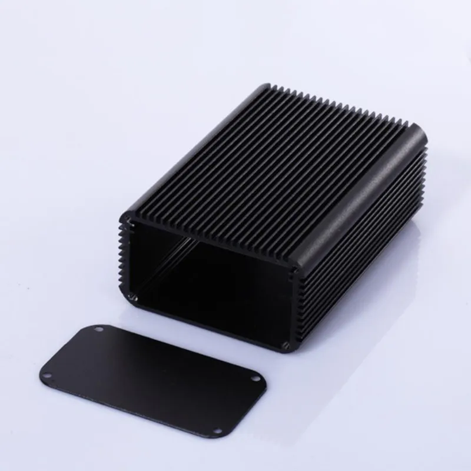
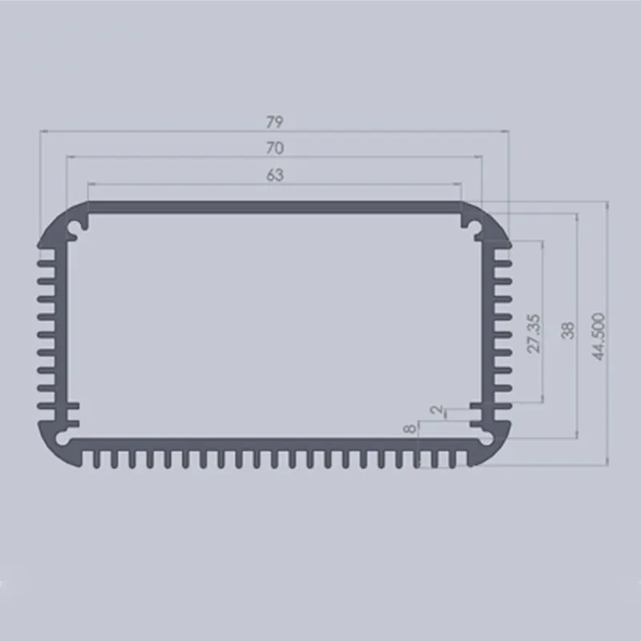

# Power rail probe

A low-noise power rail oscilloscope probe, based on the excellent writeup by
Andrew Levido and published in [Circuit Cellar](https://circuitcellar.com/research-design-hub/projects/building-a-power-rail-probe/)

The probe accepts a connection from a power rail under test, via a 50-ohm
cable. AC is passed, and an adjustable offset is applied to the DC voltage,
allowing ripple and transients to be viewed.

 * Max voltage offset ±20V
 * DC input impedance 50kΩ
 * Attenuation of 1:1.2 or better
 * Active signal range ±1V
 * Noise level < X uVrms (X dBm)
 * Isolation between chassis/USB and BNC test connectors.
 * Battery powered to minimise noise. Runtime approx X hours.
 * Li-Ion 18650 batteries rechargeable via USB-C connector (9V+ USB-PD supply required).

It should be connected to an oscilloscope set to 50-ohm input impedance.

**This project is not yet complete. Outstanding work -**
 * Final component selection & schematic verification
 * PCB layout
 * Testing and characterisation

## Schematic

[View on KiCanvas!](https://kicanvas.org/?github=https%3A%2F%2Fgithub.com%2Fblinken%2Fpower-rail-probe)

## Bill of materials

 * LMP7731 Ultra-low noise precision RRIO opamp
 * TLV2460 Low-power opamp
 * ADP7142AUJZ-2.5 +2.5V 200 mA low noise LDO Linear Regulator
 * ADP7182AUJZ-2.5 -2.5V 200 mA low noise LDO Linear Regulator
 * MCP73213T-A6SI/MF Dual-cell, Li-Ion/Li-Polymer charge management controller, 8.4V float
 * STUSB4500QTR Standalone USB PD sink controller
 * Molex 105450-0101 USB-C receptacle
 * An aluminium extrusion case suitable for a 70x114mm board - eg, [AliExpress](https://www.aliexpress.com/item/1005003326971939.html)

## License

[CC BY-SA 3.0](https://creativecommons.org/licenses/by-sa/3.0/)
