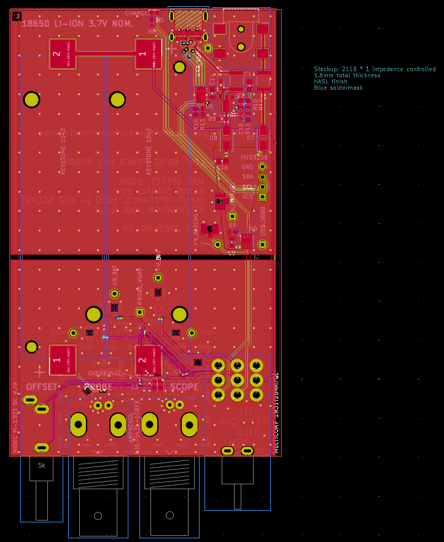

# Power rail probe

**An Open Hardware low-noise power rail oscilloscope probe**, based on the excellent writeup by
[Andrew Levido](https://circuitcellar.com/research-design-hub/projects/building-a-power-rail-probe/)
[[PDF archive](doc/circuit_cellar-building_a_power_rail_probe.pdf)].

The probe allows you to measure millivolt-level ripple on a power rail up to 20V,
using a normal oscilloscope, by applying a vertical offset. It costs <10% of the price of the [Tektronix TPR1000](https://www.tek.com/en/datasheet/active-power-rail-probes).

Here's how it works:

The probe is directly connected to a power rail you're interested in (eg, via a
1X oscilloscope probe, or a direct cable connection).  AC is passed, and an
adjustable offset is applied to the DC voltage.  Your oscilloscope sees 0V DC,
allowing power supply ripple and transients to be viewed at the 1 mV/div
setting, rather than 5 V/div. It's effectively a much more powerful DC offset
function for your oscilloscope.

## Specifications

 * Max voltage offset ±20V
 * Input impedance 50kΩ (0 - 30kHz) / 50Ω (30kHz - 1GHz)
 * Average signal attenuation of 1:1.15 (approx. -0.5 dB) * Noise <500 µVp-p over full bandwidth
 * Active signal range ±1V
 * Isolation between chassis/USB and BNC test connectors
 * Battery powered to minimise noise
 * Li-Ion 18650 batteries rechargeable via USB-C connector (9V+ USB-PD supply required) or via DC barrel jack

The probe should be connected to an oscilloscope set to 50-ohm input impedance, and
works best with inputs <1-ohm impedance.

[Feedback and comments on the design](https://github.com/blinken/power-rail-probe/issues) are very much appreciated.

## How to buy

The probe is available to purchase fully assembled from the distributors below
for approx. £299 (USD $380, EUR €345). Purchasing a fully assembled unit covers
the costs of development!

 * [paradar.co.uk](https://paradar.co.uk/products/low-noise-oscilloscope-power-rail-probe)

If you would like to assemble the probe yourself, blank PCBs and enclosures are also available at [paradar.co.uk](https://paradar.co.uk/products/low-noise-oscilloscope-power-rail-probe).

Gerber files and a full BOM & schematic are available below under a CC BY-SA 4.0 license.

## Schematic

[[PDF](doc/schematic.pdf)] [[KiCanvas](https://kicanvas.org/?github=https%3A%2F%2Fgithub.com%2Fblinken%2Fpower-rail-probe)]

## Layout

[[PDF](doc/layout.pdf)] [[KiCanvas](https://kicanvas.org/?github=https%3A%2F%2Fgithub.com%2Fblinken%2Fpower-rail-probe)]

## Frequency response

Frequency response is flat within 1dB, with the exception of a 2.5dB peak at 71.8kHz.

The chart above was obtained through simulation with TINA-TI SPICE, assuming an
input impedance of 0.1Ω. Measuring the frequency response with a 50Ω source
(ie. a standard VNA) will produce different results.

[[Simulation files](./doc/spice)]

## Noise analysis

The design aims to minimise the noise introduced by the instrument. Low-noise
operation is achieved through careful layout to minimise noise-generating
elements in the critical path, plus battery operation.  Batteries are recharged
when the instrument is turned off.

The total noise introduced by the probe ([simulated in TINA-TI SPICE v9](./doc/spice)) is
78.7 µVrms when measuring over the total instrument bandwidth 10Hz and 1GHz.

The noise introduced depends on the bandwidth of the measurement. Reducing the
measured bandwidth will reduce the noise introduced, and so the numbers below
are a worst-case upper limit. For example, a measurement between 10kHz and
20kHz, the probe will introduce 12.9 µVrms noise (-84.8 dBm).

| Measurement bandwidth  | Total RMS noise | Total peak-to-peak noise (6σ) | Power (Z0=50Ω) |
| --- | --- | --- | --- |
| 10Hz - 10kHz | 12.9 µVrms | 77.4 µVp-p | -84.8 dBm |
| 1kHz - 10kHz | 11.9 µVrms | 71.4 µVp-p | -85.5 dBm |
| 10Hz - 100kHz | 76.3 µVrms | 457.8 µVp-p | -69.3 dBm |
| 10Hz - 1MHz | 78.4 µVrms | 470.4 µVp-p | -69.1 dBm |
| 10Hz - 10MHz | 78.5 µVrms | 471.0 µVp-p | -69.1 dBm |
| 10Hz - 100MHz | 78.5 µVrms | 471.0 µVp-p | -69.1 dBm |
| 10Hz - 1GHz | 78.7 µVrms | 472.2 µVp-p | -69.1 dBm |

## Bill of materials

[[CSV](./bom/low-noise-power-probe-bom-pcba.csv)]

 * [LMP7731](https://www.ti.com/lit/ds/symlink/lmp7731.pdf) Ultra-low noise precision RRIO opamp
 * [OPA322](https://www.ti.com/lit/ds/symlink/opa322.pdf) 20-MHz low-noise 1.8-V RRIO opamp
 * [ADP7142AUJZ-2.5](https://www.analog.com/media/en/technical-documentation/data-sheets/ADP7142.pdf) +2.5V 200 mA low noise LDO Linear Regulator
 * [ADP7182AUJZ-2.5](https://www.analog.com/media/en/technical-documentation/data-sheets/ADP7182.pdf) -2.5V 200 mA low noise LDO Linear Regulator
 * [MCP73213T-A6SI/MF](https://ww1.microchip.com/downloads/aemDocuments/documents/OTH/ProductDocuments/DataSheets/20002190D.pdf) Dual-cell, Li-Ion/Li-Polymer charge management controller, 8.4V float
 * [HUSB238](https://en.hynetek.com/uploadfiles/site/219/news/1ad9e8fa-b39c-46a5-a984-152771d4ac69.pdf) Standalone USB PD sink controller
 * 2x [Amphenol 031-5431-10RFX](https://www.farnell.com/cad/2353820.pdf) isolated BNC connectors
 * [Multicomp 1M31T2B4M7QE](https://www.farnell.com/datasheets/1810474.pdf) 3PDT switch
 * [Molex 105450-0101](https://www.molex.com/en-us/products/part-detail/1054500101) USB-C receptacle
 * [Nidec M-1303](https://www.mouser.co.uk/datasheet/2/972/m-1827099.pdf) 5k 3-turn potentiometer
 * [DC050-T](https://datasheet.lcsc.com/lcsc/1912111437_SHOU-HAN-DC050-T_C431534.pdf) barrel jack connector
 * Selection of SMD resistors, capacitors, LEDs and diodes as marked
 * An aluminium extrusion case suitable for a 70x114mm board - eg, [AliExpress](https://www.aliexpress.com/item/1005003326971939.html)

## Front/rear panel layout

Click to expand.

## License

[CC BY-SA 4.0](https://creativecommons.org/licenses/by-sa/4.0/)
